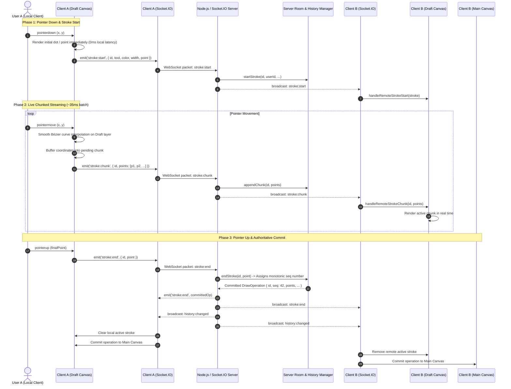
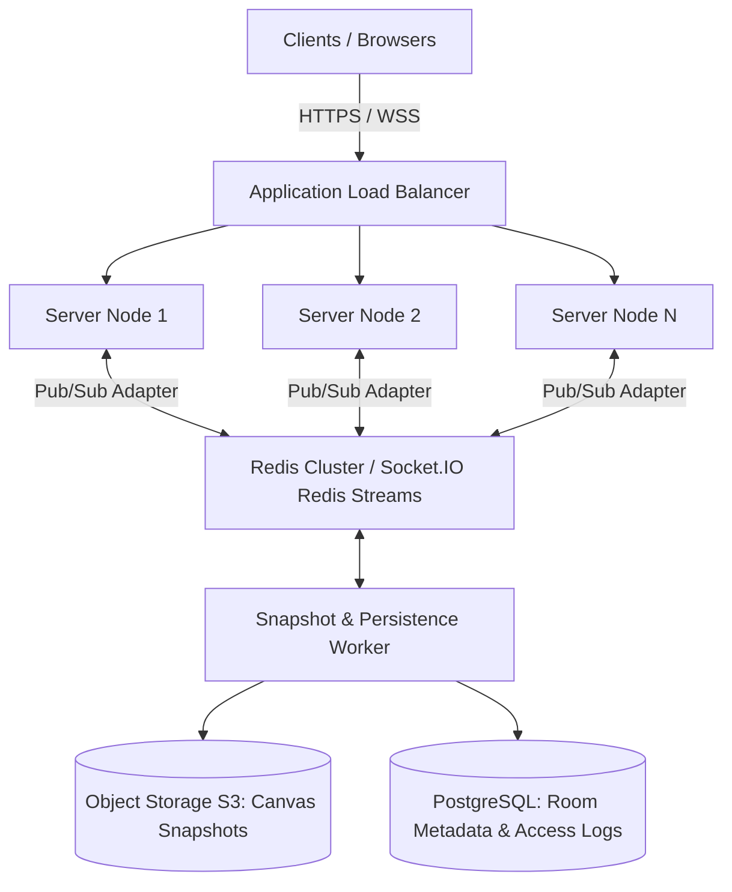

# 🏗️ Architecture & Technical Design: Real-Time Collaborative Canvas

This document details the architectural decisions, rendering pipeline, real-time networking protocols, conflict resolution models, and scalability considerations for the **Real-Time Collaborative Drawing Canvas**.

---

## 1. End-to-End Data Flow Architecture

The diagram below illustrates the life cycle of a drawing operation, from local pointer input to remote peer rendering and server-authoritative history persistence:



---

## 2. WebSocket Event Protocol & Payload Contracts

All events are strictly typed through [`shared/protocol.ts`](file:///Users/raghul/.gemini/antigravity/scratch/collaborative-canvas/shared/protocol.ts) and validated at the server boundary before processing.

### Event Specification Matrix

| Event Name | Direction | Throttling | Purpose |
| :--- | :--- | :--- | :--- |
| `room:join` | Client → Server | Once per room | Join a room session and request initial snapshot |
| `room:snapshot` | Server → Client | Unicast response | Authoritative snapshot of room state and active participants |
| `presence:update` | Server → Room | Debounced | Broadcasts user list changes (join, leave, disconnect) |
| `cursor:move` | Client ⇄ Server | Throttled ~35ms | Floating cursor position synchronization |
| `stroke:start` | Client ⇄ Server | Event-driven | Initializes a new active stroke |
| `stroke:chunk` | Client ⇄ Server | Batched ~35ms | In-progress points streaming before pointer up |
| `stroke:end` | Client ⇄ Server | Event-driven | Finalizes stroke and assigns authoritative sequence number |
| `canvas:clear` | Client ⇄ Server | Event-driven | Clears all committed strokes across all room participants |
| `history:undo` | Client → Server | Event-driven | Pops latest committed operation from room timeline |
| `history:redo` | Client → Server | Event-driven | Restores latest undone operation to room timeline |
| `history:changed`| Server → Room | Event-driven | Broadcasts updated canonical operations list |
| `client:ping` | Client → Server | Interval (3s) | Network RTT latency calculation |
| `server:pong` | Server → Client | Unicast | Timestamp reply for latency measurement |
| `app:error` | Server → Client | Unicast | Error feedback on invalid payload or rejected action |

### Example Payloads

#### `room:snapshot`
```json
{
  "roomId": "design-sprint",
  "you": {
    "id": "socket_9a8f",
    "name": "Cosmic Lynx 42",
    "color": "#3b82f6",
    "joinedAt": 1726117200000
  },
  "users": [
    {
      "id": "socket_9a8f",
      "name": "Cosmic Lynx 42",
      "color": "#3b82f6",
      "cursor": { "x": 340.5, "y": 210.0 },
      "joinedAt": 1726117200000
    },
    {
      "id": "socket_12bc",
      "name": "Azure Falcon 19",
      "color": "#10b981",
      "cursor": { "x": 620.0, "y": 450.2 },
      "joinedAt": 1726117180000
    }
  ],
  "operations": [
    {
      "id": "op_1726117205123_x7a",
      "seq": 1,
      "userId": "socket_12bc",
      "userName": "Azure Falcon 19",
      "tool": "brush",
      "color": "#10b981",
      "width": 6,
      "points": [{ "x": 100, "y": 100 }, { "x": 105, "y": 108 }, { "x": 112, "y": 120 }],
      "timestamp": 1726117205123
    }
  ],
  "activeStrokes": [],
  "canUndo": true,
  "canRedo": false,
  "serverTime": 1726117210000
}
```

#### `stroke:chunk`
```json
{
  "id": "op_1726117205123_x7a",
  "userId": "socket_12bc",
  "points": [
    { "x": 115.4, "y": 123.8 },
    { "x": 120.1, "y": 129.5 },
    { "x": 126.0, "y": 134.2 }
  ]
}
```

---

## 3. Room & Operation Data Models

### Room Data Model
Each room in [`server/room-manager.ts`](file:///Users/raghul/.gemini/antigravity/scratch/collaborative-canvas/server/room-manager.ts) maintains:
- **`roomId`**: Unique string identifier.
- **`users`**: Map of `socketId -> RoomUser`.
- **`drawing`**: Dedicated instance of `DrawingStateManager`:
  - `operations`: Array of committed operations (`DrawOperation[]`).
  - `undoStack`: Array of undone operations (`DrawOperation[]`).
  - `activeStrokes`: Map of active stroke ID to in-flight points (`Map<string, ActiveStroke>`).
  - `sequenceNumber`: Monotonically increasing counter (`number`).

### Operation Data Model
```typescript
interface DrawOperation {
  id: string;        // Client-generated unique ID (op_<timestamp>_<random>)
  seq: number;       // Server-assigned authoritative sequence number
  userId: string;    // Author socket ID
  userName: string;  // Author display name
  tool: 'brush' | 'eraser';
  color: string;     // Hex or CSS color string
  width: number;     // Stroke width in logical pixels
  points: Point[];   // Sampled coordinate stream
  timestamp: number; // Server commitment timestamp
}
```

---

## 4. Global Collaborative Undo/Redo Strategy

### Shared Room Timeline vs. Local Undo
In a multi-user collaborative workspace (such as Google Docs, Miro, or Figma), undo semantics require careful design:

1. **Local-only Undo**: User A only undos their own strokes.
   - *Problem*: If User B drew on top of User A's stroke, undoing User A's stroke leaves a visual "hole" underneath User B's drawing or causes confusing reordering of overlapping layers.
2. **Global Collaborative Undo (Implemented)**:
   - The room history is treated as an authoritative, shared linear timeline.
   - When **any user** clicks Undo, the server deactivates the most recently committed stroke in the room, pushing it onto the server's `undoStack`.
   - The server broadcasts `history:changed` with the updated list of active operations.
   - All clients re-render the canvas deterministically.

### Exact Behavior: User A Undoing User B's Drawing
When User B draws a stroke, and User A immediately presses `Cmd+Z`:
1. User A's client emits `history:undo`.
2. The server pops User B's stroke from `operations` and pushes it to `undoStack`.
3. The server broadcasts `history:changed` to all clients in the room.
4. Both User A and User B see User B's stroke disappear simultaneously.
5. If User A or User B clicks **Redo**, the server pops the stroke from `undoStack`, appends it back to `operations`, and broadcasts `history:changed`. The stroke reappears identically on both screens.
6. **Redo Branch Invalidation**: If any user commits a *new* stroke while `undoStack` is non-empty, the `undoStack` is cleared. This follows standard linear version control semantics, avoiding divergent timeline branches.

---

## 5. Conflict-Resolution Strategy for Overlapping Strokes

### The Problem: Asynchronous Network Latency
If User A and User B draw across the exact same screen coordinates at the exact same moment, network latency means:
- User A sees their own stroke first, then User B's.
- User B sees their own stroke first, then User A's.

Without a conflict resolution strategy, User A's screen would render A on bottom and B on top, while User B's screen would render B on bottom and A on top—resulting in divergent client state.

### The Solution: Server Monotonic Sequence Numbers (`seq`)
1. **Authoritative Sequencing**: The server maintains a strict sequence counter:
   ```typescript
   this.sequenceNumber += 1;
   op.seq = this.sequenceNumber;
   ```
2. **Deterministic Canvas Ordering**: When drawing historical operations, all clients sort operations ascending by `seq`:
   ```typescript
   this.operations.sort((a, b) => a.seq - b.seq);
   ```
3. **Painter's Algorithm**: The HTML5 2D Canvas rendering context renders operations strictly in `seq` order. Higher sequence numbers layer predictably over lower sequence numbers.
4. **Result**: Both strokes are retained. No data is lost or overwritten, and every participant in the room converges on the exact same pixel-for-pixel rendering.

---

## 6. Performance Architecture & Rendering Strategy

### 1. Dual-Layer Canvas Architecture
Redrawing an entire canvas of 1,000 historical operations on every `pointermove` event causes catastrophic dropped frames.
We solved this by splitting rendering into two canvas elements:

| Canvas Layer | Purpose | When Cleared / Redrawn |
| :--- | :--- | :--- |
| **Main Canvas** (`#mainCanvas`) | Holds committed operations (`seq` order) | Only upon `undo`, `redo`, `clear`, `snapshot`, or `resize` |
| **Draft Canvas** (`#draftCanvas`) | Ephemeral active strokes (local user + remote peer chunks) | On active stroke updates; cleared when stroke commits |

When a stroke ends:
1. It is drawn once directly onto the Main Canvas.
2. The Draft Canvas is cleared of that stroke.
3. Historical strokes are never re-rendered during live drawing.

### 2. Midpoint Bézier Smoothing
Standard `ctx.lineTo` polylines appear jagged and angular. We use quadratic Bézier curves with calculated midpoints:
```typescript
ctx.beginPath();
ctx.moveTo(points[0].x, points[0].y);

for (let i = 1; i < points.length - 1; i++) {
  const midX = (points[i].x + points[i + 1].x) / 2;
  const midY = (points[i].y + points[i + 1].y) / 2;
  ctx.quadraticCurveTo(points[i].x, points[i].y, midX, midY);
}

ctx.lineTo(points[points.length - 1].x, points[points.length - 1].y);
ctx.stroke();
```

### 3. Throttled Chunk Emission
High-frequency pointer events can fire at 120Hz–240Hz on modern touch screens. Emitting a WebSocket event per pointer pixel would overwhelm network sockets.
- **Stroke Chunks**: Batched via `setInterval` (~35ms / ~30Hz).
- **Cursor Movements**: Throttled using `performance.now()` delta (~35ms).
- **Zero Local Latency**: Local pointer coordinates are rendered immediately to the draft canvas before any socket emission.

---

## 7. Scaling Toward 1,000 Concurrent Users

While the current architecture handles dozens of collaborators per room with sub-5ms local latency, scaling to 1,000+ concurrent users across hundreds of rooms involves several strategic architectural milestones:



### Scalability Roadmap

1. **Horizontal Scaling via Socket.IO Redis Adapter**:
   - Replace single-node in-memory maps with `@socket.io/redis-adapter` or `@socket.io/redis-streams-adapter`.
   - Any client connected to Node 1 can broadcast to peers connected to Node 2 seamlessly across the Redis pub/sub backplane.
2. **Spatial Partitioning / Viewport Culling**:
   - For massive canvases with hundreds of concurrent drawers, divide the canvas into a quadtree grid (e.g. 512x512 pixel tiles).
   - Only transmit live stroke chunks and cursor updates to users whose viewport intersects the active tile.
3. **Delta Encoding & Binary Serialization**:
   - Replace JSON payloads with binary serialization (e.g. Protocol Buffers, MessagePack, or FlatBuffers).
   - Point coordinates can be quantized into 16-bit integer deltas, reducing network payload size by ~75%.
4. **Snapshot Checkpointing & Garbage Collection**:
   - Periodically compress historical paths into flattened raster snapshots (WebP/PNG) stored on S3/Cloud Storage.
   - When a new user joins a room with 10,000 historical strokes, the server serves a single raster base snapshot plus the recent operational delta, reducing initial load time from seconds to milliseconds.
